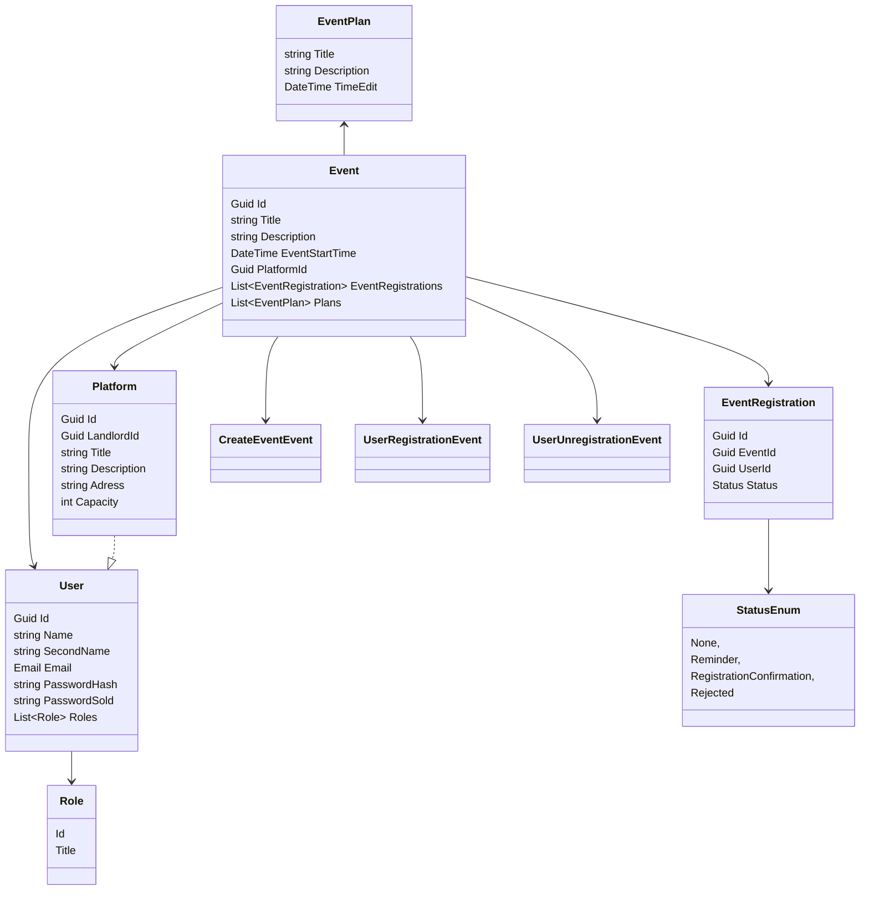

```mermaid
classDiagram
    User --> Role

    Event --> User
    Event --> Platform
    Event --> EventRegistration
    EventRegistration --> StatusEnum
    Event --> CreateEventEvent
    Event --> UserRegistrationEvent
    Event --> UserUnregistrationEvent
    EventPlan <-- Event
    Platform ..|> User

    class Role{
        Id
        Title
    }

    class User{
        Guid Id
        string Name
        string SecondName
        Email Email
        string PasswordHash
        string PasswordSold
        List~Role~ Roles
    }

    class Event{
        Guid Id
        string Title
        string Description
        DateTime EventStartTime
        Guid PlatformId
        List~EventRegistration~ EventRegistrations 
        List~EventPlan~ Plans
    }

    class Platform{
        Guid Id
        Guid LandlordId
        string Title
        string Description
        string Adress
        int Capacity
    }

    class EventRegistration{
        Guid Id
        Guid EventId
        Guid UserId
        Status Status
    }

    class StatusEnum{
        None,
        Reminder, 
        RegistrationConfirmation,
        Rejected
    }

    class EventPlan{
        string Title
        string Description
        DateTime TimeEdit
    }
```
