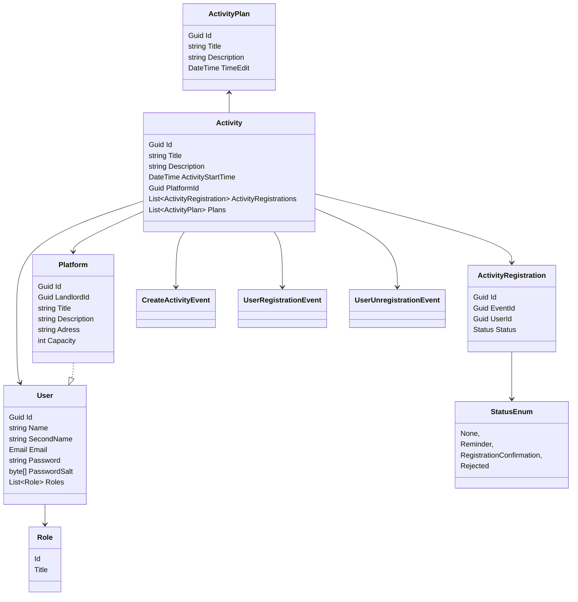

```mermaid
classDiagram
    User --> Role

    Activity --> User
    Activity --> Platform
    Activity --> ActivityRegistration
    ActivityRegistration --> StatusEnum
    Activity --> CreateActivityEvent
    Activity --> UserRegistrationEvent
    Activity --> UserUnregistrationEvent
    ActivityPlan <-- Activity
    Platform ..|> User

    class Role{
        Id
        Title
    }

    class User{
        Guid Id
        string Name
        string SecondName
        Email Email
        string Password
        byte[] PasswordSalt
        List~Role~ Roles
    }

    class Activity{
        Guid Id
        string Title
        string Description
        DateTime ActivityStartTime
        Guid PlatformId
        List~ActivityRegistration~ ActivityRegistrations 
        List~ActivityPlan~ Plans
    }

    class Platform{
        Guid Id
        Guid LandlordId
        string Title
        string Description
        string Adress
        int Capacity
    }

    class ActivityRegistration{
        Guid Id
        Guid EventId
        Guid UserId
        Status Status
    }

    class StatusEnum{
        None,
        Reminder, 
        RegistrationConfirmation,
        Rejected
    }

    class ActivityPlan{
        Guid Id
        string Title
        string Description
        DateTime TimeEdit
    }
```
